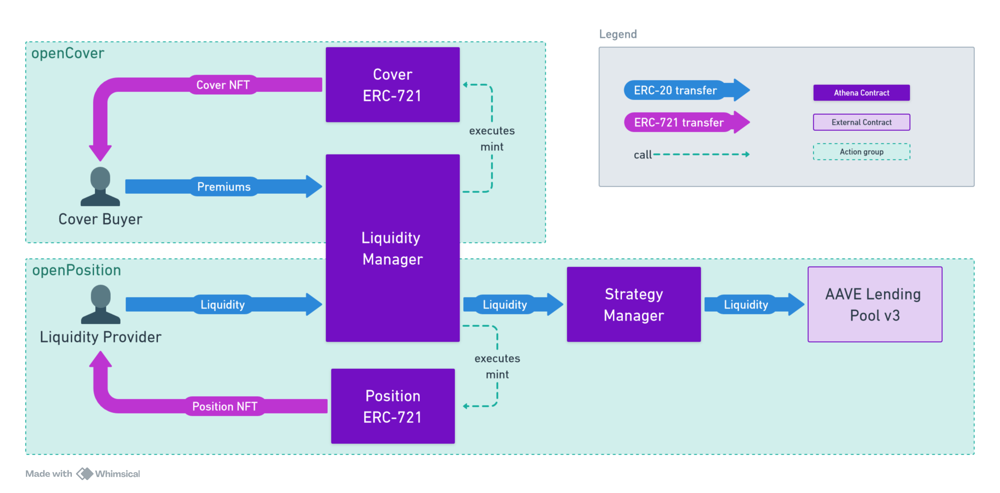

# Audit guidelines

This document is intended as a support for your auditing process.

Our documentation is minimal at this time but we are working on improving it. In the meantime, contact us through message or calls if you want more details regarding a specific issue.

To contact me:

- WhatsApp: +33619959453
- Telegram: https://t.me/blackwhale_eth
- Discord: vblackwhale

## Objectives

As a first audit for a beta launch we feel it is important to underline the objectives so your work can be narrowed down to our current needs. Some improvements are already on our to-do list but are not implement yet and analysis of these elements would be redundant with our future internal work.

Here are the aspect in which your help can help us the most:

- Ensuring the core logic of the protocol cannot cause major losses of user funds.
- Ensuring the contracts do not present attack vectors that could cause major losses of user funds.

Here are some aspects that you can overlook to make the most of your time:

- Out of scope components. This will be audited further on once they have been adequately tested.
- Team level threat vectors. Such as "owner has too much privilege over x" as some of these are intentional for the first iteration and will be removed in the following version.
- Informational, gas optimization or low level bugs. At the moment we are solely interested in security.

## Scope

The following contracts and their dependencies are the contracts that will be included in the beta:

```
src/managers/LiquidityManager.sol
src/managers/StrategyManager.sol
src/libs/VirtualPool.sol
```

The core contract of Athena is `LiquidityManager`, this is the entry point for all essential functions. It heavily relies on the `VirtualPool` library for internal cover pool management and `StrategyManager` for liquidity management. These are the 3 core files that require the most attention.

As the beta will launch with limited features you can exclude the following contracts from the scope:

```
src/interfaces/*
src/managers/ClaimManager.sol
src/misc/EcclesiaDao.sol
src/misc/MerkleDistributor.sol
src/mock/*
src/rewards/*
```

For libraries in `src/lib/` they should only be analysed if they are imported directly or indirectly in an in-scope contract.
For tokens in the `src/tokens/` they can be assumed to be trusted and safe.

## Core functions

These are the core write functions that will be active during beta and require auditing:

```
createPool
openCover
updateCover
openPosition
addLiquidity
commitRemoveLiquidity
uncommitRemoveLiquidity
removeLiquidity
takeInterests
withdrawCompensation
```

## How does it work ?

The following diagram can help you get a first grasp of how the protocol works.

### Pools

The pool connects liquidity providers and cover buyers. It is a combination of 2 DeFi protocols:

- The covered protocol. This is the one that is insured by the liquidity in the pool.
- The strategy protocol. This is the one where the liquidity is invested to earn extra rewards.

The pricing of covers in the pool depends on its usage. The more the pool's capital is already in use for covers, the more expensive they are. This is similar to the borrowing APR of AAVE lending pools.

### Covers

Users can buy covers for their assets invested in the covered protocol. In exchange they will pay premiums to the liquidity providers that insure their assets. Their cover is represented by an ERC-721 sent to their wallet.

### Positions

The covers are enabled by the liquidity provided by other users. Liquidity providers send funds that will earn cover premiums in exchange for providing insurance. If a covered user loses funds to an exploit in the cover pool, they will pay for it. Their funds also earn them rewards in the strategy they chose. Their position is represented by an ERC-721 sent to their wallet.

A position can only have a single strategy but can "leverage" their capital in several pools. The position will earn premium rewards in each pool while also being exposed to the risk of loss in every pool.

### Claims

If the covered protocol gets exploited then cover buyers can create a claim. If it is accepted then he is paid back his insured amount. This amount is deducted from the assets provided by position owners.


