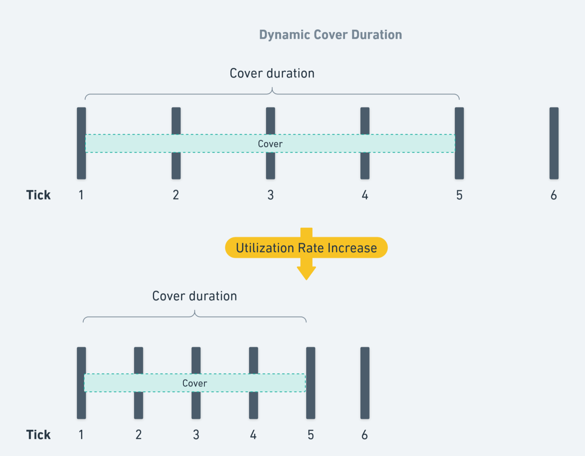

# Audit guidelines

This document is intended as a support for your auditing process.

Our documentation is minimal at this time but we are working on improving it. In the meantime, contact us through message or calls if you want more details regarding a specific issue.

To contact me:

- WhatsApp: +33619959453
- Telegram: https://t.me/blackwhale_eth
- Discord: vblackwhale

## Objectives

As a first audit for a beta launch we feel it is important to underline the objectives so your work can be narrowed down to our current needs. Some improvements are already on our to-do list but are not implement yet and analysis of these elements would be redundant with our future internal work.

Here are the aspect in which your help can help us the most:

- Ensuring the core logic of the protocol cannot cause major losses of user funds.
- Ensuring the contracts do not present attack vectors that could cause major losses of user funds.

Here are some aspects that you can overlook to make the most of your time:

- Out of scope components. This will be audited further on once they have been adequately tested.
- Team level threat vectors. Such as "owner has too much privilege over x" as some of these are intentional for the first iteration and will be removed in the following version. Current tests are not extensive enough for us to feel comfortable removing any kind of intervention in case of critical failure.
- Informational, gas optimization or low level bugs. At the moment we are solely interested in security. There is a lot of room for improvement but for the moment safety of user funds is the number one priority.

## Scope

The following contracts and their dependencies are the contracts that will be included in the beta:

```
src/managers/LiquidityManager.sol
src/managers/StrategyManager.sol
src/libs/VirtualPool.sol
```

The core contract of Athena is `LiquidityManager`, this is the entry point for all essential functions. It heavily relies on the `VirtualPool` library for internal cover pool management and `StrategyManager` for liquidity management. These are the 3 core files that require the most attention.

For libraries in `src/lib/` they should only be analysed if they are imported directly or indirectly in an in-scope contract.

As the beta will launch with limited features you can exclude the following contracts from the scope:

```
src/interfaces/*
src/managers/ClaimManager.sol
src/misc/EcclesiaDao.sol
src/misc/MerkleDistributor.sol
src/mock/*
src/rewards/*
src/tokens/*
```

### About Tokens

The tokens used to pay premiums and provide liquidity are chosen by Athena and will always be blue chip ERC-20 tokens. As such there is no need to explore "exotic" ERC-20 implementation such as: rebasing tokens, tokens with fees on transfers, etc. The only non-standard ERC-20 differentiation to expect is variable decimals, such as stablecoins with 6 decimals.

## Core functions

These are the core write functions that will be active during beta and require auditing:

```
createPool
openCover
updateCover
openPosition
addLiquidity
commitRemoveLiquidity
uncommitRemoveLiquidity
removeLiquidity
takeInterests
withdrawCompensation
```

# How does it work ?

Athena is a DeFi protocol that allows users to protect their DeFi investments from hacks and also bet on the security of protocols in exchange for rewards. Cover buyers chose a DeFi protocol (AAVE, Compound, Lido, etc.) and how much assets they want to protect and in what protocol their funds are

## Vocabulary

### Pools

The pool connects liquidity providers and cover buyers. A pool is a combination of 2 DeFi protocols:

- The covered protocol. This is the protocol that can be insured by the liquidity in the pool.
- The strategy protocol. This is the one where the liquidity is invested to earn extra rewards.

Generally the pool is meant to protect funds in DeFi protocols but a pool could also protect against the depeg of an asset (stablecoin) or even insure real world asset such as cars. This is because there is no on-chain interaction between the pool and the protected protocol/asset.

The pricing of covers in the pool depends on its usage. The more the pool's capital is already in use for covers, the more expensive they are. This is similar to the lending/borrowing APR of AAVE lending pools.

### Virtual Pool

We use the term virtual pool because pools are not independent contracts, such as Uniswap pools for example. Each pool has its own storage pointer in the `LiquidityManager.sol` and uses the `VirtualPool.sol` library to interact with the storage. This also mean that all the unused premiums of different pools are held by the `LiquidityManager.sol` contract. The liquidity for all pools is held and handled by the `StrategyManager.sol` contract.

### Covers

Users can buy covers for their assets invested in a DeFi protocol: the covered protocol. In exchange they will pay premiums to the liquidity providers that insure their assets. Their cover is represented by an ERC-721 sent to their wallet.

### Positions

The covers are enabled by the liquidity provided by other users. Liquidity providers send assets (ERC-20) that will earn cover premiums in exchange for providing insurance. If the covered DeFi protocol is hacked, then cover buyers will be paid back using the liquidity in the pool. The assets deposited in a pool also earn rewards in the strategy protocol of the pool. Their position is represented by an ERC-721 sent to their wallet.

A position can only have a single strategy but can "leverage" their capital in several pools. The position will earn premium rewards in each pool while also being exposed to the risk of paying back cover buyers in each chosen pool.

### Claims

If the covered protocol gets exploited then cover buyers can create a claim. If it is accepted then he is paid back his insured amount. This amount is deducted from the assets provided by position owners/liquidity providers.

Initially claims will be handled manually but soon we'll be using Kleros's decentralized court. Ignore the `ClaimManager.sol` for this audit but be sure to review the `withdrawCompensation` function in the `LiquidityManager.sol`.

### Compensations

A compensation is the result of a claim being paid out, it is registered in the `LiquidityManager.sol` storage in order to compute the potential losses that a position has sustained.

### Utilization Rate

### Premium Rate

### Premiums

### Tick

### Ray

### Leverage

### Underlying Asset / Wrapped Asset

### Strategy Reward Index / Liquidity Index

## Mechanics

Here is an overall diagram to visualize how cover creation and liquidity provision works and the token flow of these interactions.





## Miscelanous Information

### Overusage

### Ray

purgeExpiredCoversUpTo
updatePositionUpTo
