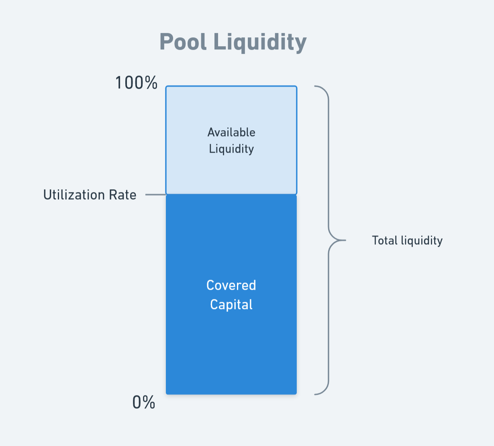
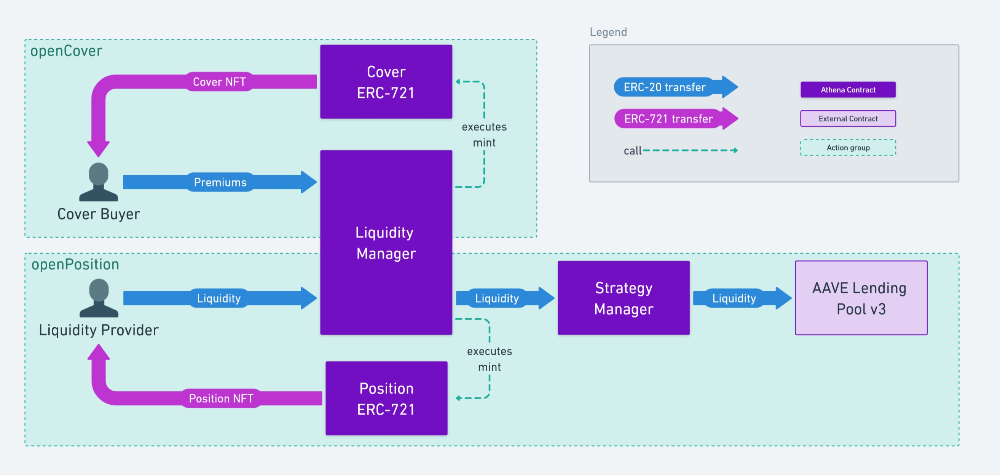
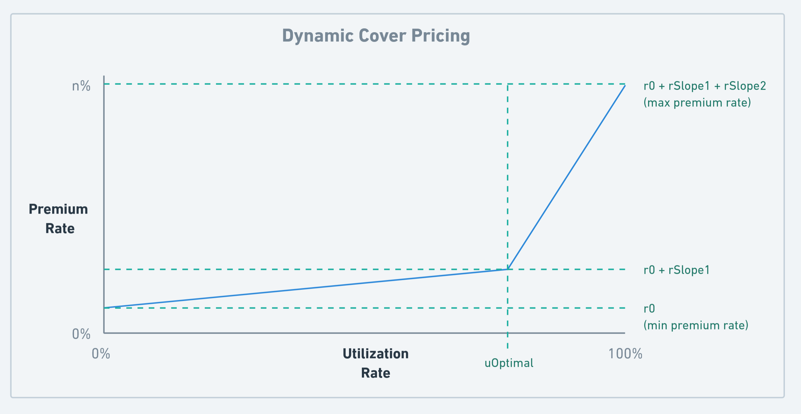
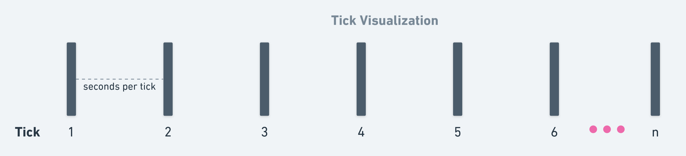
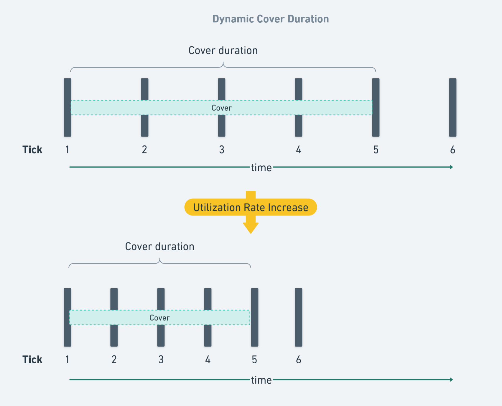
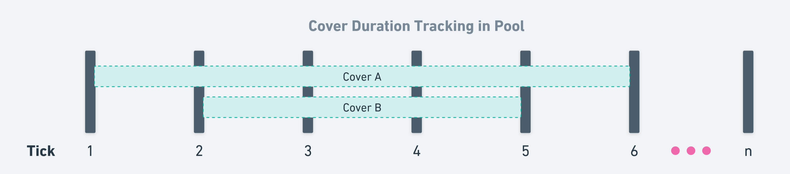
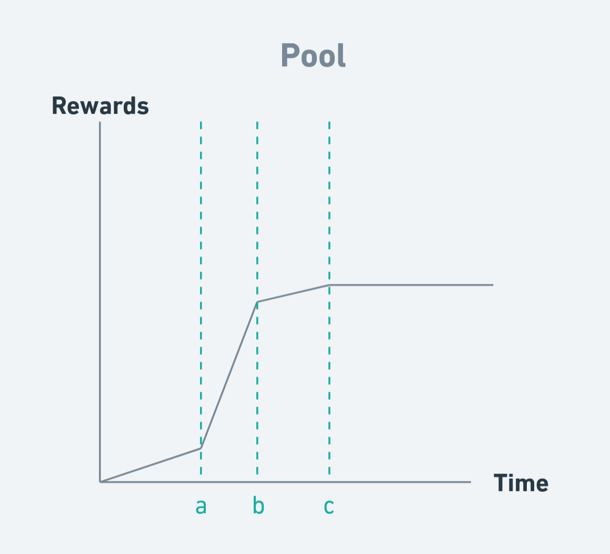
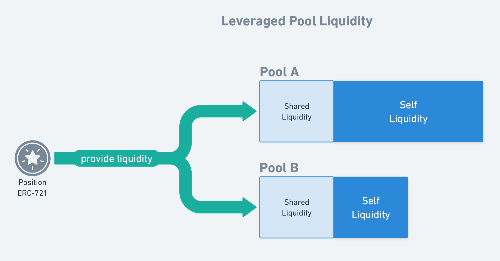
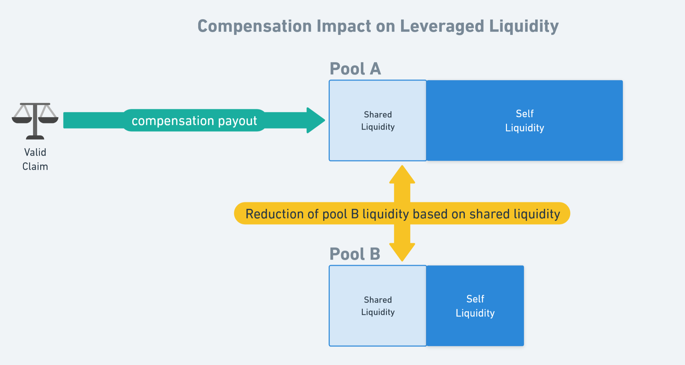

# Audit guidelines

This document is intended as a support for your auditing process.

Our documentation is minimal at this time but we are working on improving it. In the meantime, contact us through message or calls if you want more details regarding a specific issue.

To contact me:

Victor (blackwhale)

- WhatsApp: +33 619959453
- Telegram: https://t.me/blackwhale_eth
- Discord: vblackwhale - https://discordapp.com/users/vblackwhale

## Tech Stack

- Solidity 0.8.25
- Typescript
- Hardhat
- Ethers v5 (BigNumber)
- Typechain
- Mocha + Chai

## Objectives

As a first audit for a beta launch we feel it is important to underline the objectives so your work can be narrowed down to our current needs. Some improvements are already on our to-do list but are not implement yet and analysis of these elements would be redundant with our future internal work.

Here are the aspect in which your help can help us the most:

- Ensuring the core logic of the protocol cannot cause major losses of user funds.
- Ensuring the contracts do not present attack vectors that could cause major losses of user funds.

Here are some aspects that you can overlook to make the most of your time:

- Out of scope components. This will be audited further on once they have been adequately tested.
- Team level threat vectors. Such as "owner has too much privilege over x" as some of these are intentional for the first iteration and will be removed in the following version. Current tests are not extensive enough for us to feel comfortable removing any kind of intervention in case of critical failure.
- Informational, gas optimization or low level bugs. At the moment we are solely interested in security. There is a lot of room for improvement but for the moment safety of user funds is the number one priority.

## Scope

The following contracts and their dependencies are the contracts that will be included in the beta:

```
src/managers/LiquidityManager.sol
src/managers/StrategyManager.sol
src/libs/VirtualPool.sol
```

The core contract of Athena is `LiquidityManager`, this is the entry point for all essential functions. It heavily relies on the `VirtualPool` library for internal cover pool management and `StrategyManager` for liquidity management. These are the 3 core files that require the most attention.

For libraries in `src/lib/` they should only be analysed if they are imported directly or indirectly in an in-scope contract.

As the beta will launch with limited features you can exclude the following contracts from the scope:

```
src/interfaces/*
src/managers/ClaimManager.sol
src/misc/EcclesiaDao.sol
src/misc/MerkleDistributor.sol
src/mock/*
src/rewards/*
src/tokens/*
```

### About Tokens

The tokens used to pay premiums and provide liquidity are chosen by Athena and will always be blue chip ERC-20 tokens. As such there is no need to explore "exotic" ERC-20 implementation such as: rebasing tokens, tokens with fees on transfers, etc. The only non-standard ERC-20 differentiation to expect is variable decimals, such as stablecoins with 6 decimals.

## Core functions

These are the core write functions that will be active during beta and require auditing:

```
createPool
openCover
updateCover
openPosition
addLiquidity
commitRemoveLiquidity
uncommitRemoveLiquidity
removeLiquidity
takeInterests
withdrawCompensation
```

## Running tests

You have a lot of helpers in the `test/helpers/` folder that can help you execute actions or deploy the whole protocol with just a few parameters. This will definetily be helpuful to you task. You can also check the `test/context.ts` file to get an idea of all the tools available to you through the `this` context within tests.

A good starting point to run tests against the contracts is to copy either:
- `test/integration/sanity.test.ts`
- `test/scenarios/allActions.ts`

Both of these tests include all the main actions and can easily be modified in order to run you test cases. Then:

- To include another test file add it to `test/index.ts`
- To include another test scenario add it to `test/scenarios/scenario.test.ts`
- You can comment out any test you want to skip in `test/index.ts`

Finally after having completed you `.env` file you can run the tests with:

```
$ npm run test
```

Additionally you can get faster tests execution by activating parallelization in `hardhat.config.ts`. Be warned that this will probably break sequentiality of `console.log` within tests suites.  

```
 // parallel: true,
```


&nbsp;
&nbsp;

# How does it work ?

Athena is a DeFi protocol that allows users to protect their DeFi investments from hacks and also bet on the security of protocols in exchange for rewards. Cover buyers chose a DeFi protocol (AAVE, Compound, Lido, etc.) and how much assets they want to protect and in what protocol their funds are

## Vocabulary

### Pools

The pool connects liquidity providers and cover buyers. A pool is a combination of 2 DeFi protocols:

- The covered protocol. This is the protocol that can be insured by the liquidity in the pool.
- The strategy protocol. This is the one where the liquidity is invested to earn extra rewards.

Generally the pool is meant to protect funds in DeFi protocols but a pool could also protect against the depeg of an asset (stablecoin) or even insure real world asset such as cars. This is because there is no on-chain interaction between the pool and the protected protocol/asset.

The pricing of covers in the pool depends on its usage. The more the pool's capital is already in use for covers, the more expensive they are. This is similar to the lending/borrowing APR of AAVE lending pools.

### Virtual Pool

We use the term virtual pool because pools are not independent contracts, such as Uniswap pools for example. Each pool has its own storage pointer in the `LiquidityManager.sol` and uses the `VirtualPool.sol` library to interact with the storage. This also mean that all the unused premiums of different pools are held by the `LiquidityManager.sol` contract. The liquidity for all pools is held and handled by the `StrategyManager.sol` contract.

### Covers

Users can buy covers for their assets invested in a DeFi protocol: the covered protocol. In exchange they will pay premiums to the liquidity providers that insure their assets. Their cover is represented by an ERC-721 sent to their wallet.

### Positions

The covers are enabled by the liquidity provided by other users. Liquidity providers send assets (ERC-20) that will earn cover premiums in exchange for providing insurance. If the covered DeFi protocol is hacked, then cover buyers will be paid back using the liquidity in the pool. The assets deposited in a pool also earn rewards in the strategy protocol of the pool. Their position is represented by an ERC-721 sent to their wallet.

A position can only have a single strategy but can "leverage" their capital in several pools. The position will earn premium rewards in each pool while also being exposed to the risk of paying back cover buyers in each chosen pool.

### Claims

If the covered protocol gets exploited then cover buyers can create a claim. If it is accepted then he is paid back his insured amount. This amount is deducted from the assets provided by position owners/liquidity providers.

Initially claims will be handled manually but soon we'll be using Kleros's decentralized court. Ignore the `ClaimManager.sol` for this audit but be sure to review the `withdrawCompensation` function in the `LiquidityManager.sol`.

### Compensations

A compensation is the result of a claim being paid out, it is registered in the `LiquidityManager.sol` storage in order to compute the potential losses that a position has sustained.

### Utilization Rate

The percentage of liquidity in a pool that is currently locked as a guarantee for bought covers.

```
i.e.

Total liquidity in pool = $ 10 000
Total covered amount in pool = $ 3 500

=> Utilization = 35%
```

<div align="center">
    
</div>

### Premiums

The tokens deposited by a cover buyer that will pay liquidity providers for the protection they provide. The amount deposited is up to the cover buyer. An estimated protection duration can be computed upon creating a cover but this can change. The actual rate at which the premiums are spent will depend of the premium rate, which can change based on utilization.

### Premium Rate

The APR cost of holding a cover in a given pool. This value is expressed in rays so 1e27 = 1%.

```
i.e.

Covered amount = $ 100
Premium APR = 2%

=> Annual cost of cover = $ 2
```

### Reward Rate

The APR for providing liquidity in a given pool. This value is obtained by multiplying the utilization rate and the premium rate.

```
i.e.

Utilization rate = 50%
Premium APR = 8%

=> Reward APR = 4%
```

### Ray

A ray is equal to 1e27, 27 decimals, 100000000000000000000000000. It is used to scale up values when computing percentages in order to avoid precision loss or rounding errors. Often used with a base 100 for rates so 1 ray would be equal to 1%.

### Leverage

In the context of Athena, a position is using leverage when it provides liquidity to more than one pool. So a x2 leverage for a position means the liquidity is added in 2 pools. This leverage enables liquidity provider to earn more rewards and cover providers to have access to more liquidity. The downside is more risk for liquidity providers and the system as a whole.

### Overlaps

An overlap is the total amount of liquidity shared between two pools. This occurs when positions use leverage to provide liquidity to several pools. The overlap of a pool with itself is the pool's total liquidity. The own/self/unleveraged liquidity is liquidity that was provided without it being shared with any other pool.

### Underlying Asset / Wrapped Asset

The strategy manager can handle the underlying asset of a pool or the wrapped/receipt version that a DeFi protocol provides against deposits. For example in the case of the USDT lending pool in AAVE then the underlying asset is USDT and the wrapped asset is aUSDT.

### Strategy Reward Index / Liquidity Index

These indexes track the accumulation of strategy rewards and premium rewards respectively. This value can only increase over time as more rewards are earned. This is similar to how Ethereum liquid staking tokens increase in value over time as rewards compound.

The computation of the strategy reward index can vary depending on the DeFi protocol being used by the strategy. For AAVE this value is already available through view functions in their contracts.

For the liquidity index corresponding to premium rewards here is how it is computed:

```
i.e.

Utilization rate = 50%
Premium APR = 8%

=> Reward APR = 50% * 8% = 4%

Number of ticks elapsed = 10
Seconds per tick = 86400

=> Total time elapsed = 10 * 86400 = 864000

Rewards = capital * rewards APR * (total time elapsed / one year) = 0.109589 %
```

## Mechanics

### Token interactions

Here is an general diagram to visualize the interactions & token flows between `LiquidityManager.sol` and `StrategyManager.sol` in the context of cover creation and liquidity provision.



### Premium Rate Formula

The premium rate uses the formula configuration of a pool to compute the current premium rate based on utilization. The premium rate follows a bi-linear curve based on 4 parameters, all these values are expressed in rays so 1e27 = 1%.

These are the formula parameters:

```
uOptimal - the optimal utilization rate of the pool
r0 - the base/minimal premium rate at 0% utilization
rSlope1 - the APR that is linearly added to r0 between 0% utilization and uOptimal
rSlope2 - the APR that is linearly added to r0 + rSlope1 between uOptimal and 100% utilization
```

```
i.e.

uOptimal = 80%
r0 = 2%
rSlope1 = 6%
rSlope2 = 15%

Utilization rate = 40%
=> Premium rate = 2% + 6% * (40%/80%) = 5%

Utilization rate = 90%
=> Premium rate = 2% + 6% + 15% * ((90% - 80%) / (100% - 80%)) = 15.5%
```

<div align="center">
    
</div>

### Ticks

Ticks are a core component of how covers are tracked in pools. You can imagine it as a timeline axis with a variable spacing between them. This spacing is the number of seconds between each tick. The first tick is 1 and not 0.

The ticks also track the moment covers expire so that we can keep track of utilization and earned premiums. A tick will store the cover IDs of covers that expire once that tick ends. Each tick can either be initialized, meaning it contains at least one cover (to be expired) or uninitialized, meaning there is no cover in that tick.

<div align="center">
    
</div>

#### Seconds per tick

- Can also be referred to as tick spacing
- The seconds per tick is the same for all ticks
- The max value for seconds per tick is 86400 seconds (1 day)
- The minimal value for seconds per tick is 86400 \* (minimum premium rate (r0) / max premium rate (r0 + rSlope1 + rSlope2))
- The seconds per tick value changes based on pool usage. At 0% utilization it is equal to the max value since covers are cheaper and their premiums last longer. At 100% utilization it is equal to the minimal value since covers are more expensive and their premiums are spent faster.

#### Tick storage

The virtual pool uses the following maps to keep track of tick data:

```js
    // Maps an word position index to a bitmap of tick states (initialized or not)
    mapping(uint24 _wordPos => uint256 _bitmap) tickBitmap;
    // Maps a tick to the list of cover IDs
    mapping(uint32 _tick => uint256[] _coverIds) ticks;
```

As you can see `ticks` is where cover IDs are stored in the tick at which they expire. The `tickBitmap` is used only through the `TickBitmap.sol` library, we never access this mapping directly through `_wordPos`. This mapping tracks the status (initialized or not) within the bits of an uint256 number. This enables us to parse faster large amounts of tick that might not contain covers.

### Covers Duration and Ticks

You can image covers as existing on the tick timeline. Their span is measured in ticks, which can be converted to seconds using the current seconds per tick. They start at the tick at which they were first created and are active until the tick in which their ID is stored is overtaken.

You can imagine tick contracting and expanding as usage varies in a pool:

<div align="center">
    
</div>

#### Here are a few observations we can make from the following diagram :

- Cover A was created between tick 1 and 2 with a duration of 5 ticks
- Cover B was created between tick 2 and 3 with a duration of 3 ticks
- When cover B was created, utilization increased, so the tick spacing decreased and the duration of cover A (in seconds) was reduced
- Once the pool reached tick 5 then cover B expired, utilization decreased, so the tick spacing increased and the duration of cover A (in seconds) was increased

<div align="center">
    
</div>

### Computing premium rewards

You will see that when updating a position we perform a compute heavy operation in each pool the position is participating in. That function is `_processCompensationsForPosition` and its complexity is the consequence of several criteria affecting premium reward computation.

Consider the following diagram that represents the premium rewards of a position being accumulated for a pool it provided liquidity to:

<div align="center">
    
</div>

&nbsp;

Here are some scenarios that could explain the changes in reward rate taking place at a, b and c:

#### a.

- Increase in utilization because of new covers
- Increase in utilization because liquidity was removed from the pool
- Increase in utilization because a pool with overlapped capital reduced liquidity in pool
- Increase in rewards because the user added more liquidity to their position

#### b.

- Decrease in utilization rate because covers expired
- Decrease in utilization rate because covers was closed
- Decrease in utilization rate because liquidity was added in the pool
- Reduction of the position's capital because the user removed liquidity from their position
- Loss of position capital because of compensations in the pool
- Loss of position capital because of compensations in another pool of the position

#### c.

- Decrease in utilization to 0% because all covers expired
- Decrease in utilization to 0% because all covers were closed
- Reduction of the position's capital to 0 because the user removed all liquidity from their position
- Loss of all position capital because of compensations in the pool
- Loss of all position capital because of compensations in another pool of the position

This is the reason why we parse all the compensations and see if it matches a pool in the position. We need to correctly update utilization and capital so that we can compute the correct amount of rewards for a given period.

### Implications of leverage

The fact that liquidity providers may use leverage when creating positions means liquidity has several dimensions to it. A pool will can have part of its liquidity shared with any other compatible pool.

#### Here are a few observations we can make from the following diagram :

- The position creator is using leverage to provide liquidity to 2 cover pools
- The position will earn premium rewards in both pools, at the same rate as any other liquidity provider in those pools
- Since the position is using leverage it will have to pay an additional fee to the risk fund in order to reduce systemic protocol risk
- The position's capital is exposed to the risk of paying bay cover buyers in both pools
- Both pool A and pool B will need to have enough available liquidity for the position owner to withdraw
- If a compensation is paid out in pool A then pool B's liquidity will be reduced because of the shared liquidity, the reverse is also true

<div align="center">
    
</div>

&nbsp;

```
i.e. (see next diagram)

Pool A has a liquidity of $3000, including $1000 of shared with pool B.
Pool B has a liquidity of $2000, including $1000 of shared with pool A.

Imagine if a $1000 compensation payout affected pool A.
This is how liquidity in these pools will be affected:

First we must compute the ratio of the compensation in the pool where it takes place:
compensation amount / total liquidity = 1000 / 3000 = 33%

For pool A, the claim pool, we apply this ratio to the total liquidity: 
- 3000 * 33% = $1000
For pool B, the dependant pool, we apply this ratio to the liquidity overlap with pool A:
- 1000 * 33% = $333

Therefore after the claim:
- Pool A liquidity will be: 3000 - 1000 = $2000
- Pool B liquidity will be composed of $1333 of self liquidity + $667 of shared liquidity
- Pool B liquidity will be: 2000 - 333 = $1667
- Pool B liquidity will be composed of $1000 of self liquidity + $667 of shared liquidity
- Unleveraged liquidity providers in Pool A will have lost 33% of their capital
- Unleveraged liquidity providers in Pool B will have lost 0% of their capital
- Leveraged liquidity providers in Pool A + B will have lost 33% of their capital
- The cover buyer will be paid $1000 out from funds in the stategy common to pool A and B
```

<div align="center">
    
</div>

## Miscellaneous Information

### Over-usage

You may have noticed that in theory the leverage of capital can cause a scenario where the reduction of capital in one pool can make another insolvent. To compensate for this systemic risk there are two core measures:

- Preemptive:

The compatibility of pools that may be leveraged in one position is carefully studied so that the risk of synchronous hacks/failures are minimal. We asses the dependencies of project at the code and protocol dependency level so that cover buyers are still protected in the unlikely event of simultaneous critical events.

- Corrective:

When users use leverage to increase the APR of their positions they pay an extra fee, the risk fee. The higher the leverage (number of pools), the higher the risk fee. This fee impacts the premiums received by liquidity providers. Risk fees are accumulated as backup liquidity in case a pool's covers no longer have the adequate liquidity to protect them.

### Updating the pool

As the pool heavily relies on the current tick being up to date when making operation that interact with liquidity. This is why you'll see almost all operations start by calling `_purgeExpiredCovers` on a pool before interacting with its storage.

This operation will remove expired covers and refresh key parameters in the pool so that the operation can be performed against an up to date state. A certain number of view functions will also compute this refreshed state in order to provide up to date data even if they have not been written to storage yet.

### Claim Manager (onlyClaimManager)

Currently claims will be handled manually but soon we'll be implementing the latest Kleros (https://kleros.io/) court system to handle claim processing in fully decentralized manner. In the mean time consider the claim manager to be a trusted EOA.

### Tick optimization

Yes. There are too many loops and probably significant gas savings to make. We'd love to hear your ideas but at the moment it is essential that user funds are secure and the protocol usable. Please focus on security. My optimization-loving-heart is broken too but we need to get this protocol on-chain before making it better.

### Debug functions (purgeExpiredCoversUpTo & updatePositionUpTo)

Because of some edge case / DoS scenarios that we discovered, we have implemented these to functions as way to make partial updates for certain potentially gas heavy updates. In extreme scenarios these operations could be pushed above the 30M gas unit limit in a block. Even if this scenario is highly unlikely, we chose to implement these backup functions just in case. These are restricted as they are not meant to be called by common users and their side effects under unrestricted conditions have not been studied enough.

### Owner privilege

Again we want to acknowledge that the current implementation provides a lot of privileges to the owner wallet. This can be mentioned in the report for disclosure to the users but these are meant as temporary safety measures before we are confident that the implementation is secure. We chose to delay full decentralization and permissionlessness in order to avoid potentially blocking scenarios.

# Conclusions

You've reached the end! If you need any clarification please reach out.

Now let's break stuff and have fun. Happy hunting :)
